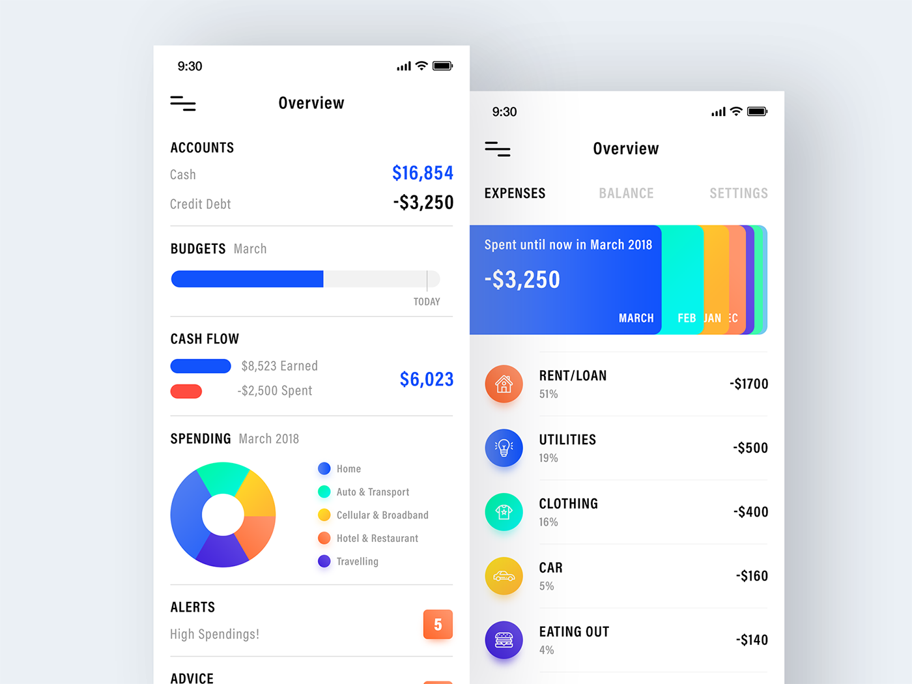

# Expense Tracker App

Welcome to Expense Tracker App - your personal finance manager!

## About Expense Tracker App

Expense Tracker App is a mobile application developed in Flutter that helps you keep track of your expenses and manage your finances more effectively. With intuitive features and user-friendly interface, Expense Tracker App makes it easy to monitor your spending, set budgets, and achieve your financial goals.

## Features

- **Expense Tracking**: Record your daily expenses and categorize them for better organization.
- **Budget Management**: Set monthly budgets for different expense categories and track your spending against them.
- **Data Visualization**: View detailed reports and visualizations of your spending habits to identify trends and areas for improvement.
- **Expense Reminders**: Set reminders for recurring expenses to ensure you never miss a payment.
- **Secure Authentication**: Protect your financial data with secure authentication methods such as biometric authentication or PIN code.

## Screenshots

## Contributing

We welcome contributions from the community to help improve and enhance Expense Tracker App. Whether it's fixing bugs, adding new features, or providing feedback, your contributions are valuable to us. Feel free to fork our repository, make changes, and submit pull requests.

## Feedback

We'd love to hear your feedback! If you have any suggestions, feature requests, or encounter any issues while using Expense Tracker App, please don't hesitate to reach out to us. You can contact us through [email](mailto:hitarthrajpal2312@gmail.com) or [submit an issue](https://github.com/yourusername/expensetrackerapp/issues) on GitHub.

## License

Expense Tracker App is licensed under the [MIT License](LICENSE).
